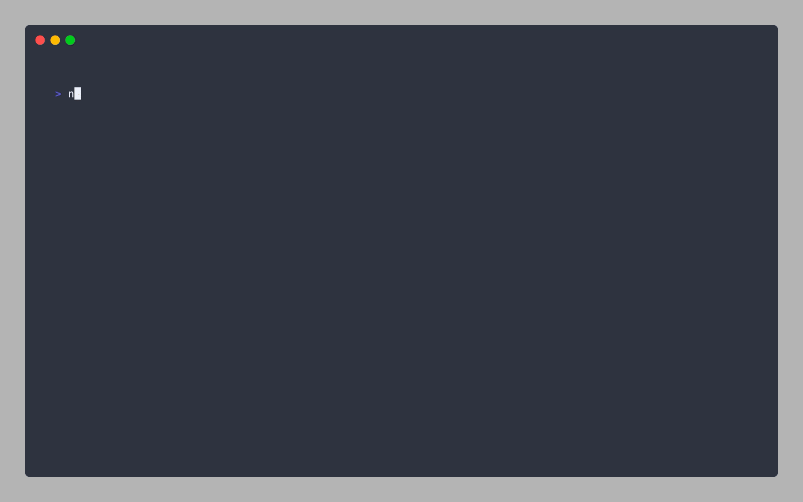
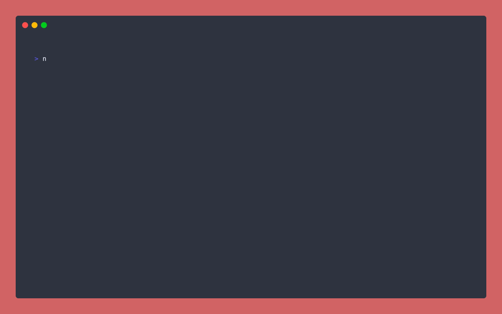
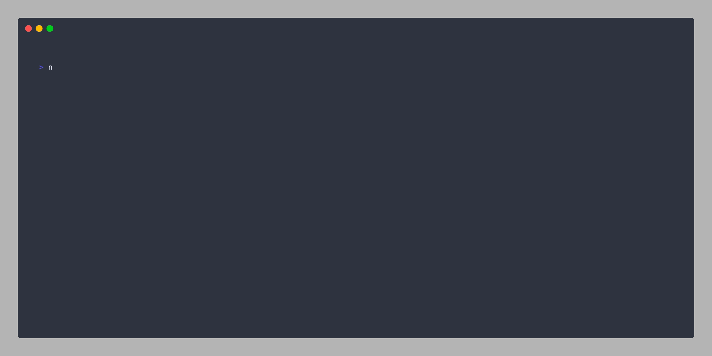
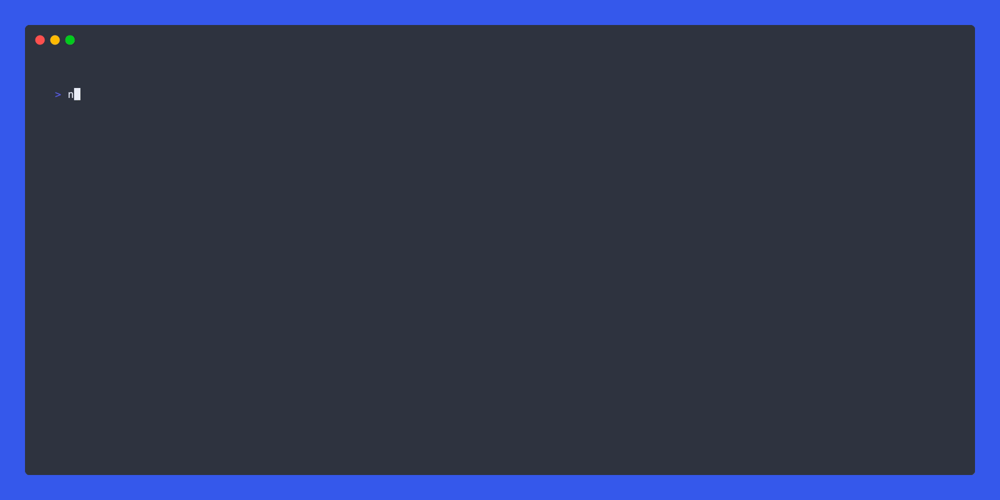
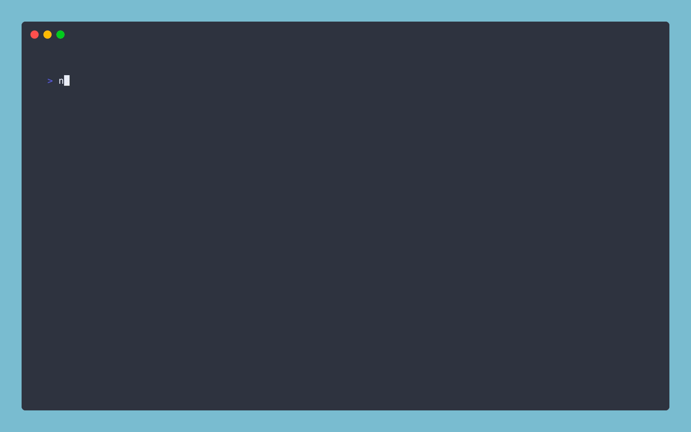

 <h2 align=center>🎭 Playwright cli-select</h2>
<p align="center">
</p>

<p align="center">
Playwright interactive cli prompts to select and run specs, tests or tags.
</p>



## Features

- ❓ New interactive CLI prompts to select and run specs, tests or tags
- 🎭 A new `playwright test` command to allow user to pass desired arguments

## External Resources

- [Dev blog: playwright-cli-select](https://dev.to/dennisbergevin/playwright-cli-select-12j)

#### Table of Contents

- [Installation](#installation)
- [Run mode](#run-mode)
- [Command line arguments](#command-line-arguments)
  - [Using last failed](#using-last-failed)
  - [Using only changed](#using-only-changed)
- [UI mode](#ui-mode)
  - [Keyboard controls](#keyboard-controls)
- [Help mode](#help-mode)
- [Submit focused](#submit-focused)
- [Optional path to test list json](#optional-path-to-test-list-json)
- [Using a custom playwright config file](#using-a-custom-playwright-config-file)
- [Setting up a `npm` script](#setting-up-a-npm-script)
- [Contributions](#contributions)

---

## Installation

1. Install the following package:

```sh
npm install --save-dev playwright-cli-select
# within your Playwright repository as dev dependency

# Or

npm install -g playwright-cli-select
# global install
```

---

## Run mode

Run the following command in your Playwright repository:

```bash
npx playwright-cli-select run
```

If you want to skip straight to selecting specs, titles and/or tags:

```bash
npx playwright-cli-select run --specs
# skips straight to spec selection

npx playwright-cli-select run --titles
# skips to test title selection

npx playwright-cli-select run --tags
# skips to tag selection

npx playwright-cli-select run --titles --tags
# skips to test title selection, followed by tag selection
# Any combination of `--specs`, `--titles` and/or `--tags` parameters is permitted.
```



---

## Command line arguments

You can also include more cli arguments similar to `npx playwright test`:

```bash
npx playwright-cli-select run --project firefox webkit
```

### Using last failed

Passing Playwright's `--last-failed` parameter filters the available selections in each prompt to the last failed tests.

Using this package, you can further drill down on specific tests within the last failed tests:

```sh
npx playwright-cli-select run --last-failed
```



### Using only changed

Passing Playwright's `--only-changed` parameter filters available selections to the changed tests detected.

To specify a specific subset of changed tests rather than running entire changed test files:

```sh
npx playwright-cli-select run --only-changed
```



---

## UI mode

You can append the `--ui` or `--headed` parameters to open a browser and view selected specs, test titles and/or tags:

```bash
npx playwright-cli-select run --ui

# Or

npx playwright-cli-select run --titles --headed
# Example of choosing only test titles to run headed
```

---

### Keyboard controls

|              Keys              |             Action              |
| :----------------------------: | :-----------------------------: |
|         <kbd>Up</kbd>          | Move to selection above current |
|        <kbd>Down</kbd>         | Move to selection below current |
|         <kbd>Tab</kbd>         |         Select current          |
| <kbd>Ctrl</kbd> + <kbd>a</kbd> |           Select all            |
|      <kbd>Backspace</kbd>      |        Remove selection         |
|        <kbd>Enter</kbd>        |             Proceed             |
| <kbd>Ctrl</kbd> + <kbd>c</kbd> |              Exit               |

**Note**: You can also filter choices displayed in list by typing

---

## Help mode

To open the cli help menu, pass the `--help` flag:

```bash
npx playwright-cli-select run --help
```



---

## Submit focused

When no other options are already selected, automatically select the currently focused option with <kbd>Enter</kbd>.

To enable this feature, pass the following flag:

```bash
npx playwright-cli-select run --submit-focused
```

---

## Optional path to test list json

This package uses the `npx playwright test --list --reporter=json` command to gather information about Playwright tests.

If you prefer or already house the data from this command in a file, pass the path to the file via the `--json-data-path` parameter:

```bash
npx playwright-cli-select run --json-data-path data/sample-test-list.json
```

---

## Using a custom playwright config file

If you want to use a custom Playwright config, pass it via the `-c` or `--config` flag:

```bash
npx playwright-cli-select run --config playwright.staging.config.js

# Or

npx playwright-cli-select run -c playwright.dev.config.js
```

---

## Setting up a `npm` script

For convenience, you may desire to house the `npx` command within an npm script in your project's `package.json`, including any desired cli arguments:

```json
  "scripts": {
    "pw:select": "npx playwright-cli-select run --project=firefox"
  }
```

---

## Contributions

Feel free to open a pull request or drop any feature request or bug in the [issues](https://github.com/dennisbergevin/playwright-cli-select/issues).

Please see more details in the [contributing doc](./CONTRIBUTING.md).
